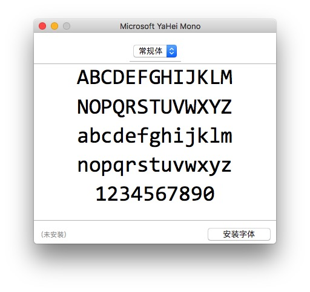
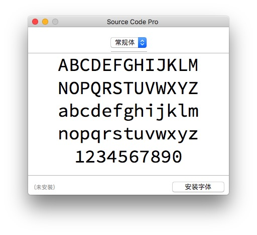

Sublime Text 3 资源
---

### 1. 主题及配色方案

+ [Soda Theme（虽然经典，但是很久没更新了）](https://github.com/buymeasoda/soda-theme)
+ [Afterglow（目前在用的，支持 Retina 屏）](https://github.com/YabataDesign/afterglow-theme)
+ [Material Theme](https://github.com/equinusocio/material-theme) & [Materialize](https://github.com/saadq/Materialize)
+ [tmTheme Editor（一个在线的配色方案编辑工具）](https://github.com/aziz/tmTheme-Editor)
+ [搜索更多主题](https://github.com/search?p=2&q=sublime+text+3+theme&ref=searchresults&type=Repositories&utf8=%E2%9C%93)

> 一个完整版的 Theme + Color_Theme，请移步这里[stx3-theme-and-color_theme](https://github.com/whorusq/stx3-theme-and-color_theme)

### 2. 插件

#### 2.1. 安装 Package Control

所有插件基于 Package Control 进行管理，官网地址：[https://packagecontrol.io/installation](https://packagecontrol.io/installation) ，可以通过如下两种方式进行安装：

- 方式一：自动安装

	在 Sublime Text 中按键 **ctrl+`** 或 依次单击菜单 **View > Show Console** ，输入如下命令：

	```python
	import urllib.request,os,hashlib; h = 'df21e130d211cfc94d9b0905775a7c0f' + '1e3d39e33b79698005270310898eea76'; pf = 'Package Control.sublime-package'; ipp = sublime.installed_packages_path(); urllib.request.install_opener( urllib.request.build_opener( urllib.request.ProxyHandler()) ); by = urllib.request.urlopen( 'http://packagecontrol.io/' + pf.replace(' ', '%20')).read(); dh = hashlib.sha256(by).hexdigest(); print('Error validating download (got %s instead of %s), please try manual install' % (dh, h)) if dh != h else open(os.path.join( ipp, pf), 'wb' ).write(by)
	```

+ 方式二：手动安装

	- 依次单击菜单 **Preferences > Browse Packages…** ，打开目录 **Packages/**
	- 下载 [Control.sublime-package](https://packagecontrol.io/Package%20Control.sublime-package) 并拷贝到 **Packages/** 目录下
	- 重启 Sublime Text

#### 2.2. 常用插件

> 安装方式：
> 
> `ctrl+shift+p` 打开 Package Control 命令窗口 ，输入 `pip` 回车，然后再输入插件名回车，等待安装完成。
> 
> **注意**：部分插件安装好后需手动重启

* [Alignment](https://github.com/wbond/sublime_alignment) 代码自动对齐
* AutoFileName
* [ BracketHighlighter](https://github.com/facelessuser/BracketHighlighter) 高亮配对符号 --> [高亮色彩配置](./插件BracketHighlighter高亮色彩配置.md)
* DocBlockr 注释
* [Emmet](https://emmet.io/)（前身是 Zen Coding，前端必备）
* jQuery
* [FileDiffs](https://github.com/colinta/SublimeFileDiffs) 文件差异比较
* SideBarEnhancements 侧边栏加强
* [SulimeCodeIntel](https://github.com/SublimeCodeIntel/SublimeCodeIntel) 代码提示和补全插件
* ...


### 3. 图标

[请直接看这里](./icons.md)

### 4. 快捷键

```bash
# 通用（General）
---

↑↓←→：上下左右移动光标，注意不是不是KJHL！
Alt：调出菜单
Ctrl + Shift + P：调出命令板（Command Palette）
Ctrl + `：调出控制台

# 编辑（Editing）
---

Ctrl + Enter：在当前行下面新增一行然后跳至该行
Ctrl + Shift + Enter：在当前行上面增加一行并跳至该行
Ctrl + ←/→：进行逐词移动
Ctrl + Shift + ←/→进行逐词选择
Ctrl + ↑/↓移动当前显示区域
Ctrl + Shift + ↑/↓移动当前行

# 选择（Selecting）
---

Ctrl + D：选择当前光标所在的词并高亮该词所有出现的位置，再次Ctrl + D选择该词出现的下一个位置，在多重选词的过程中，使用Ctrl + K进行跳过，使用Ctrl + U进行回退，使用Esc退出多重编辑
Ctrl + Shift + L：将当前选中区域打散
Ctrl + J：把当前选中区域合并为一行
Ctrl + M：在起始括号和结尾括号间切换
Ctrl + Shift + M：快速选择括号间的内容
Ctrl + Shift + J：快速选择同缩进的内容
Ctrl + Shift + Space：快速选择当前作用域（Scope）的内容

# 查找&替换（Finding&Replacing）
---

F3：跳至当前关键字下一个位置
Shift + F3：跳到当前关键字上一个位置
Alt + F3：选中当前关键字出现的所有位置
Ctrl + F/H：进行标准查找/替换，之后：
Alt + C：切换大小写敏感（Case-sensitive）模式
Alt + W：切换整字匹配（Whole matching）模式
Alt + R：切换正则匹配（Regex matching）模式
Ctrl + Shift + H：替换当前关键字
Ctrl + Alt + Enter：替换所有关键字匹配
Ctrl + Shift + F：多文件搜索&替换

# 跳转（Jumping）
---

Ctrl + P：跳转到指定文件，输入文件名后可以：
@ 符号跳转：输入@symbol跳转到symbol符号所在的位置
# 关键字跳转：输入#keyword跳转到keyword所在的位置
: 行号跳转：输入:12跳转到文件的第12行。
Ctrl + R：跳转到指定符号
Ctrl + G：跳转到指定行号

# 窗口（Window）
---

Ctrl + Shift + N：创建一个新窗口
Ctrl + N：在当前窗口创建一个新标签
Ctrl + W：关闭当前标签，当窗口内没有标签时会关闭该窗口
Ctrl + Shift + T：恢复刚刚关闭的标签

# 屏幕（Screen）
---

F11：切换普通全屏
Shift + F11：切换无干扰全屏
Alt + Shift + 2：进行左右分屏
Alt + Shift + 8：进行上下分屏
Alt + Shift + 5：进行上下左右分屏
分屏之后，使用Ctrl + 数字键跳转到指定屏，使用Ctrl + Shift + 数字键将当前屏移动到指定屏
```

### 5. 推荐个人配置

```python
{
    // 主题、配色相关
    "theme": "Afterglow-green.sublime-theme", // 整体界面
    "color_scheme": "Packages/Theme - Afterglow/Flatland - Monokai.tmTheme", // 配色方案
    // "sidebar_no_icon": true,
    "sidebar_size_13": true,
    "sidebar_row_padding_medium": true,
    "folder_no_icon": true,
    "tabs_small": true,
    "tabs_padding_small": true,
    "tabs_padding_medium": true,
    // "tabs_label_not_italic": true,
    "status_bar_brighter": true,
    "color_inactive_tabs": true,

    // 整体设置
    // "font_face": "YaHei Consolas Hybrid",
    "font_face": "Microsoft Yahei Mono", // 字体类型
    "font_size": 12.5, // 字号
    // "font_options": [ "gray_antialias" ], // On retina Mac
    "highlight_line": true, // 高亮当前行
    // "line_numbers": true, // 显示行号
    // "gutter": false, // 显示行号边栏
    // "margin": 0, // 行号边栏和文字的间距
    "line_padding_top": 2, // 行的上间距
    "line_padding_bottom": 2, // 行的下间距
    // "draw_white_space": "all", // 显示空白符
    "show_encoding": true, // 状态栏显示当前文件编码
    "always_show_minimap_viewport": true, // 右侧总是显示代码地图可视区域
    // "draw_minimap_border": true, // 显示可视区域部分的边框
    // "bold_folder_labels": true, // 左侧边栏文字加粗
    "indent_guide_options": [ "draw_normal", "draw_active" ], // 制表位的对齐线
    "remember_open_files": true, // 记忆之前打开的文件
    // "overlay_scroll_bars": "system",
    "dpi_scale": 1.0, // 高分屏必须调整此设置
    "show_full_path": true, // 标题栏显示打开文件的完整路径

    // 删除你想要忽略的插件，需要重启
    "ignored_packages":
    [
        // "Vintage" // 是否禁用 vim 模式
    ],

    // 编辑行为
    "default_encoding": "UTF-8", // 默认编码格式
    "tab_size": 4,  // Tab键制表符宽度
    "translate_tabs_to_spaces": true, // 设为true时，缩进和遇到Tab键时使用空格替代
    "scroll_past_end": false, // 设置为false时，滚动到文本的最下方时，没有缓冲区
    // "highlight_modified_tabs": true, // 高亮内容有修改的标签
    // "find_selected_text": true, // 匹配选中的文本
    "trim_trailing_white_space_on_save": true, // 保存文件时是否删除每行结束后多余的空格
    // "ensure_newline_at_eof_on_save": false,  // 保存文件时光标是否在文件的最后向下换一行
    // "save_on_focus_lost": false, // 切换到其它文件标签或点击其它非本软件区域，文件是否自动保存
    // "auto_close_tags": true, // 自动闭合标签
    // "tab_completion": true,
    // "auto_complete": true, // 代码提示
    // "auto_complete_delay": 50, // 代码提示延迟显示
    "auto_complete_triggers": [ // 设置触发代码提醒的关键字
        {
            "selector": "text.html",
            "characters": "abcdefghijklmnopqrstuvwxyzABCDEFGHIJKLMNOPQRSTUVWXYZ.<"
        },
        {
            "selector": "text.xml",
            "characters": "abcdefghijklmnopqrstuvwxyzABCDEFGHIJKLMNOPQRSTUVWXYZ.<"
        },
        {
            "selector": "text.php",
            "characters": "abcdefghijklmnopqrstuvwxyzABCDEFGHIJKLMNOPQRSTUVWXYZ.<"
        },
        {
            "selector": "text.css",
            "characters": "abcdefghijklmnopqrstuvwxyzABCDEFGHIJKLMNOPQRSTUVWXYZ.<"
        },
        {
            "selector": "text.js",
            "characters": "abcdefghijklmnopqrstuvwxyzABCDEFGHIJKLMNOPQRSTUVWXYZ.<"
        }
    ],
    // "auto_match_enabled": true, // 自动匹配引号，括号等

    // 光标样式
    "caret_style": "smooth", // 光标闪动方式 "smooth", "phase", "blink", "wide" and "solid"
    "caret_extra_bottom": 1,
    "caret_extra_top": 1,
    "caret_extra_width": 1,

    // Word wrapping - follow PEP 8 recommendations
    "rulers": [ 82, 92 ],
    // "wrap_width": 80, // 设置窗口内文字区域的宽度
    "word_wrap": false, // true | false | auto

    // 禁止自动更新
    "update_check": false
}
```

### 6. 字体

* [Microsoft Yahei Mono](./fonts/Microsoft-Yahei-Mono.ttf)



* [Source Code Pro](./fonts/SourceCodePro-Regular.ttf)


