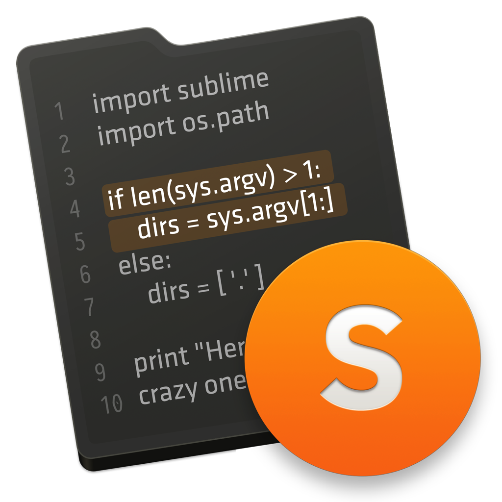

>
> 当前目录中为 png/icns 格式的图片
>
> macOS 系统可直接使用 icns 格式，windows 系统请下载后使用工具转换成 ico 格式
>
> 推荐一个在线转换工具：[iConvert Icons](https://iconsnverticons.com/online/)
>

     官方默认 |
    <a href="https://github.com/whorusq/sublime-text-3/raw/master/icons/Sublime_Text.png">PNG下载</a> | <a href="https://github.com/whorusq/sublime-text-3/raw/master/icons/Sublime_Text.icns">ICNS 下载</a>

    
    <a href="https://github.com/whorusq/sublime-text-3/raw/master/icons/st3001.png">PNG下载</a> | <a href="https://github.com/whorusq/sublime-text-3/raw/master/icons/st3001.icns">ICNS 下载</a>

    
    <a href="https://github.com/whorusq/sublime-text-3/raw/master/icons/st3002.png">PNG下载</a> | <a href="https://github.com/whorusq/sublime-text-3/raw/master/icons/st3002.icns">ICNS 下载</a>

    
    <a href="https://github.com/whorusq/sublime-text-3/raw/master/icons/st3004.png">PNG下载</a> | <a href="https://github.com/whorusq/sublime-text-3/raw/master/icons/st3004.icns">ICNS 下载</a>

    
    <a href="https://github.com/whorusq/sublime-text-3/raw/master/icons/st3005.png">PNG下载</a> | <a href="https://github.com/whorusq/sublime-text-3/raw/master/icons/st3005.icns">ICNS 下载</a>

    
    <a href="https://github.com/whorusq/sublime-text-3/raw/master/icons/st3006.png">PNG下载</a> | <a href="https://github.com/whorusq/sublime-text-3/raw/master/icons/st3006.icns">ICNS 下载</a>

    
    <a href="https://github.com/whorusq/sublime-text-3/raw/master/icons/st3007.png">PNG下载</a> | <a href="https://github.com/whorusq/sublime-text-3/raw/master/icons/st3007.icns">ICNS 下载</a>

    
    <a href="https://github.com/whorusq/sublime-text-3/raw/master/icons/st3008.png">PNG下载</a> | <a href="https://github.com/whorusq/sublime-text-3/raw/master/icons/st3008.icns">ICNS 下载</a>

    
    <a href="https://github.com/whorusq/sublime-text-3/raw/master/icons/st3009.png">PNG下载</a> | <a href="https://github.com/whorusq/sublime-text-3/raw/master/icons/st3009.icns">ICNS 下载</a>

    
    <a href="https://github.com/whorusq/sublime-text-3/raw/master/icons/st3010.png">PNG下载</a> | <a href="https://github.com/whorusq/sublime-text-3/raw/master/icons/st3010.icns">ICNS 下载</a>

    
    <a href="https://github.com/whorusq/sublime-text-3/raw/master/icons/st3011.png">PNG下载</a> | <a href="https://github.com/whorusq/sublime-text-3/raw/master/icons/st3011.icns">ICNS 下载</a>

    
    <a href="https://github.com/whorusq/sublime-text-3/raw/master/icons/st3012.png">PNG下载</a> | <a href="https://github.com/whorusq/sublime-text-3/raw/master/icons/st3012.icns">ICNS 下载</a>

