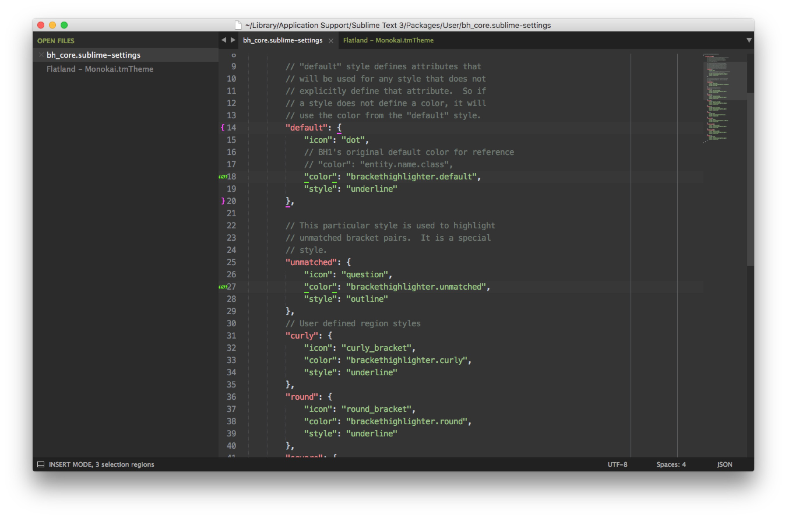

插件 BracketHighlighter 高亮色彩配置
---

### 预览



### 操作步骤

1. 用 Package Control 安装 BracketHighlighter 

2. **Preferences -> package settings -> Bracket Highlighter -> Bracket Settings – User**，添加如下配置：

	```
	// Define region highlight styles
	{
	    "bracket_styles": {
	        // "default" and "unmatched" styles are special
	        // styles. If they are not defined here,
	        // they will be generated internally with
	        // internal defaults.
	
	        // "default" style defines attributes that
	        // will be used for any style that does not
	        // explicitly define that attribute.  So if
	        // a style does not define a color, it will
	        // use the color from the "default" style.
	        "default": {
	            "icon": "dot",
	            // BH1's original default color for reference
	            // "color": "entity.name.class",
	            "color": "brackethighlighter.default",
	            "style": "underline"
	        },
	
	        // This particular style is used to highlight
	        // unmatched bracket pairs.  It is a special
	        // style.
	        "unmatched": {
	            "icon": "question",
	            "color": "brackethighlighter.unmatched",
	            "style": "outline"
	        },
	        // User defined region styles
	        "curly": {
	            "icon": "curly_bracket",
	            "color": "brackethighlighter.curly",
	            "style": "underline"
	        },
	        "round": {
	            "icon": "round_bracket",
	            "color": "brackethighlighter.round",
	            "style": "underline"
	        },
	        "square": {
	            "icon": "square_bracket",
	            "color": "brackethighlighter.square",
	            "style": "underline"
	        },
	        "angle": {
	            "icon": "angle_bracket",
	            "color": "brackethighlighter.angle",
	            "style": "underline"
	        },
	        "tag": {
	            "icon": "tag",
	            "color": "brackethighlighter.tag",
	            "style": "underline"
	        },
	        "c_define": {
	            "icon": "hash",
	            "color": "brackethighlighter.c_define",
	            "style": "underline"
	        },
	        "single_quote": {
	            "icon": "single_quote",
	            "color": "brackethighlighter.quote",
	            "style": "underline"
	        },
	        "double_quote": {
	            "icon": "double_quote",
	            "color": "brackethighlighter.quote",
	            "style": "underline"
	        },
	        "regex": {
	            "icon": "star",
	            "color": "brackethighlighter.quote",
	            "style": "underline"
	        }
	    }
	}
	```

3. 在对应的主题文件中添加如下样式设置，以自定义每种匹配的高亮颜色


	``` xml
			<!-- custom Bracket style -->
			<dict>
				<key>name</key>
				<string>Bracket Default</string>
				<key>scope</key>
				<string>brackethighlighter.default</string>
				<key>settings</key>
				<dict>
					<key>foreground</key>
					<string>#FFFFFF</string>
					<key>background</key>
					<string>#A6E22E</string>
				</dict>
			</dict>
			<dict>
				<key>name</key>
				<string>Bracket Unmatched</string>
				<key>scope</key>
				<string>brackethighlighter.unmatched</string>
				<key>settings</key>
				<dict>
					<key>foreground</key>
					<string>#FFFFFF</string>
					<key>background</key>
					<string>#FF0000</string>
				</dict>
			</dict>
			<dict>
				<key>name</key>
				<string>Bracket Curly</string>
				<key>scope</key>
				<string>brackethighlighter.curly</string>
				<key>settings</key>
				<dict>
					<key>foreground</key>
					<string>#FF00FF</string>
				</dict>
			</dict>
			<dict>
				<key>name</key>
				<string>Bracket Round</string>
				<key>scope</key>
				<string>brackethighlighter.round</string>
				<key>settings</key>
				<dict>
					<key>foreground</key>
					<string>#E7FF04</string>
				</dict>
			</dict>
			<dict>
				<key>name</key>
				<string>Bracket Square</string>
				<key>scope</key>
				<string>brackethighlighter.square</string>
				<key>settings</key>
				<dict>
					<key>foreground</key>
					<string>#FE4800</string>
				</dict>
			</dict>
			<dict>
				<key>name</key>
				<string>Bracket Angle</string>
				<key>scope</key>
				<string>brackethighlighter.angle</string>
				<key>settings</key>
				<dict>
					<key>foreground</key>
					<string>#02F78E</string>
				</dict>
			</dict>
			<dict>
				<key>name</key>
				<string>Bracket Tag</string>
				<key>scope</key>
				<string>brackethighlighter.tag</string>
				<key>settings</key>
				<dict>
					<key>foreground</key>
					<string>#FFFFFF</string>
					<key>background</key>
					<string>#0080FF</string>
				</dict>
			</dict>
			<dict>
				<key>name</key>
				<string>Bracket Quote</string>
				<key>scope</key>
				<string>brackethighlighter.quote</string>
				<key>settings</key>
				<dict>
					<key>foreground</key>
					<string>#56FF00</string>
				</dict>
			</dict>
			<!-- end custom Bracket style -->
	```
